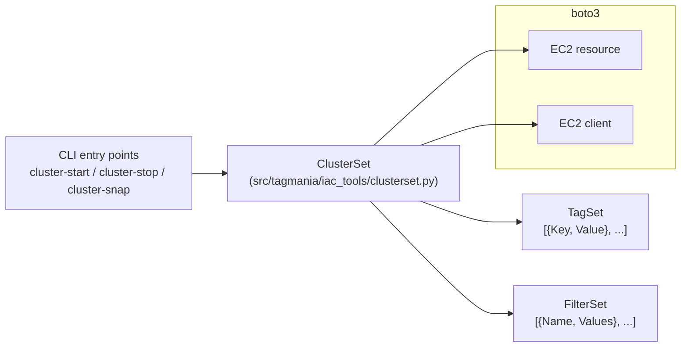

# Tagmania

[](https://github.com/svange/tagmania/actions/workflows/publish.yaml)
[](https://pypi.org/project/tagmania/)
[](https://github.com/semantic-release/semantic-release)
[](https://github.com/svange/tagmania/blob/main/LICENSE)

Manic tools for manipulating sets of tagged resources in AWS.

---

## Pipeline Artifacts

> Reports are published to GitHub Pages on every release to `main`.

| Report | Link |
|--------|------|
| API Documentation | [svange.github.io/tagmania](https://svange.github.io/tagmania/) |
| Test Report | [tests/test-report.html](https://svange.github.io/tagmania/tests/test-report.html) |
| Coverage Report | [coverage/htmlcov/](https://svange.github.io/tagmania/coverage/htmlcov/) |
| License Compliance | [compliance/license-report.html](https://svange.github.io/tagmania/compliance/license-report.html) |
| PyPI | [pypi.org/project/tagmania](https://pypi.org/project/tagmania/) |

Per-run downloadable artifacts (`bandit-report.json`, `pip-audit-report.json`, `coverage.xml`, `test-report.html`, `license-report.json`, built `dist/` on release) are available under the [Actions tab](https://github.com/svange/tagmania/actions) > select a run > scroll to "Artifacts".

---

## What This Does

Tagmania is a command-line toolkit for managing groups of AWS EC2 instances that share a `Cluster` tag. You point it at a cluster name and it can start, stop, snapshot, or restore every instance in that cluster as a single unit. It's useful if you run dev/test environments on EC2 and want a simple way to pause them overnight, back them up before risky changes, or roll an entire cluster back to a known-good state.

It operates only on resources it's been told to manage (via a `SNAPSHOT_MANAGER` automation tag), so it won't accidentally touch unrelated resources in your account.

---

## Getting Started

> This project uses AI-assisted development. You do not need to memorize
> git commands or CI configuration -- your AI agent handles that.

### Prerequisites

- **Python 3.12 or higher** (`python --version`)
- **AWS CLI profile** configured via `aws configure` or `~/.aws/credentials`
- **EC2 instances tagged** with a `Cluster` tag identifying their membership
- **IAM permissions** -- see [Minimum IAM Policy](#minimum-iam-policy) below

### First-time setup

```bash
pip install tagmania
# or, with uv
uv tool install tagmania
```

For production, pin to an exact version:

```bash
pip install tagmania==2.6.1
```

### Running locally

```bash
cluster-start  my-cluster                 # boot all instances in my-cluster
cluster-stop   my-cluster                 # stop all instances in my-cluster
cluster-snap --backup  my-cluster         # snapshot every attached EBS volume
cluster-snap --restore my-cluster         # restore volumes from most recent snapshot
cluster-snap --list    my-cluster         # list snapshots for the cluster
```

All commands accept `--profile <aws-profile>` for credential selection. See [Available Commands](#available-commands) and [Advanced Features](#advanced-features) below for more. Additional end-to-end walkthroughs live in [EXAMPLES.md](EXAMPLES.md).

### Minimum IAM Policy

The AWS identity running Tagmania needs the following permissions. Replace `my-cluster` with your actual `Cluster` tag value (or use a wildcard list if you manage multiple clusters).

```json
{
  "Version": "2012-10-17",
  "Statement": [
    {
      "Sid": "EC2Read",
      "Effect": "Allow",
      "Action": [
        "ec2:DescribeInstances",
        "ec2:DescribeSnapshots",
        "ec2:DescribeVolumes",
        "ec2:DescribeImages",
        "ec2:DescribeAvailabilityZones"
      ],
      "Resource": "*"
    },
    {
      "Sid": "InstanceStartStop",
      "Effect": "Allow",
      "Action": [
        "ec2:StartInstances",
        "ec2:StopInstances"
      ],
      "Resource": "*",
      "Condition": {
        "StringEquals": { "ec2:ResourceTag/Cluster": ["my-cluster"] }
      }
    },
    {
      "Sid": "VolumeLifecycleTagged",
      "Effect": "Allow",
      "Action": [
        "ec2:DeleteVolume",
        "ec2:AttachVolume",
        "ec2:DetachVolume",
        "ec2:CreateTags",
        "ec2:DeleteTags"
      ],
      "Resource": "*",
      "Condition": {
        "StringEquals": { "ec2:ResourceTag/Cluster": ["my-cluster"] }
      }
    },
    {
      "Sid": "VolumeCreate",
      "Effect": "Allow",
      "Action": ["ec2:CreateVolume"],
      "Resource": "*"
    },
    {
      "Sid": "SnapshotLifecycle",
      "Effect": "Allow",
      "Action": [
        "ec2:CreateSnapshot",
        "ec2:DeleteSnapshot",
        "ec2:CreateTags"
      ],
      "Resource": "*"
    }
  ]
}
```

The tagged conditions restrict the blast radius of start/stop and volume-modifying calls to instances that carry the matching `Cluster` tag. `CreateVolume` and snapshot create/delete are not tag-conditioned because AWS doesn't support that tag condition during resource creation.

The `template.yaml` in this repo uses the same policy shape for integration-test infrastructure.

---

## How to Contribute

> Contributions are made through AI agents (Claude Code, Copilot, etc.).
> You describe what you want changed in plain language; the agent handles
> branching, coding, testing, and submitting a pull request.

1. **Open Claude Code** (or your AI agent) in this repo.
2. **Describe the change** you want -- a bug fix, a new feature, a doc update.
3. The agent will:
   - Create a feature branch
   - Make the changes
   - Run pre-commit checks and tests
   - Open a pull request
4. **Review the PR** when the agent is done. CI runs automatically.
5. **Merge** once CI is green.

If you need to work manually, see the full [contributor guide](CONTRIBUTING.md).

---

## Architecture

Tagmania is a thin layer on top of `boto3`. Every CLI entry point instantiates a `ClusterSet`, which owns an EC2 resource + client and exposes tag-scoped operations on instances, volumes, and snapshots.



- **ClusterSet** is the only class that issues AWS API calls. It enforces a `_MAX_ITEMS = 150` safety cap and only touches resources tagged with its `AUTOMATION_KEY = "SNAPSHOT_MANAGER"`.
- **TagSet** and **FilterSet** are tiny wrappers around the two shapes of list-of-dicts that AWS uses (`[{Key, Value}]` for tags, `[{Name, Values}]` for filters).
- **Snapshot / volume lifecycles** run sequentially inside `ClusterSet.create_snapshots` and `create_volumes`. Targeted variants (`*_targeted`) filter by regex against the instance `Name` tag for partial cluster operations.

---

<!-- Custom sections preserved from previous README -->

## AWS Cost Warning

**⚠️ Important**: This tool operates on AWS infrastructure and can incur costs:
- EBS snapshot storage charges apply for all created snapshots
- Data transfer costs may apply when creating/restoring snapshots
- Test infrastructure in `template.yaml` will create billable EC2 instances
- Always clean up test resources after use to avoid ongoing charges

For testing, consider using AWS Free Tier eligible instance types and remember to delete snapshots when no longer needed.

## Available Commands

- `cluster-start` - Start all instances in a cluster
- `cluster-stop` - Stop all instances in a cluster
- `cluster-snap` - Create, restore, delete, and list snapshots

## Quick Start

### Starting and Stopping Clusters

```bash
# Start all instances in a cluster
cluster-start production-cluster

# Stop all instances in a cluster
cluster-stop production-cluster

# Use specific AWS profile
cluster-start --profile myprofile production-cluster
```

### Creating Snapshots

```bash
# Create a snapshot backup of entire cluster
cluster-snap --backup production-cluster

# Create a named snapshot
cluster-snap --backup --name daily-backup production-cluster
```

### Restoring from Snapshots

```bash
# Restore entire cluster from default snapshot
cluster-snap --restore production-cluster

# Restore from named snapshot
cluster-snap --restore --name daily-backup production-cluster
```

## Advanced Features

### Targeted Restore

Restore specific instances within a cluster using regex pattern matching against instance "Name" tags:

```bash
# Restore only web servers
cluster-snap --restore --target ".*-web-.*" production-cluster

# Restore specific instance
cluster-snap --restore --target "server-01" --name daily-backup production-cluster
```

**Common Targeting Patterns:**
- `".*-web-.*"` - All instances with "web" in the name
- `"server-[0-9]+"` - Instances named server-1, server-2, etc.
- `"prod-api-.*"` - All production API servers
- `"backup-db"` - Specific instance named "backup-db"

### Snapshot Management

```bash
# List all snapshots for a cluster
cluster-snap --list production-cluster

# List specific labeled snapshots
cluster-snap --list --name daily-backup production-cluster

# Delete specific snapshot set
cluster-snap --delete --name daily-backup production-cluster

# Delete all snapshots for cluster
cluster-snap --delete production-cluster
```

## How It Works

### Backup Process
1. Stops all cluster instances
2. Creates EBS snapshots of all attached volumes
3. Tags snapshots with cluster and label information
4. Instances remain stopped after backup (use `cluster-start` to restart)

### Restore Process
1. Stops all cluster instances (or targeted instances)
2. Detaches and deletes current EBS volumes
3. Creates new volumes from snapshots
4. Attaches new volumes to instances
5. Instances remain stopped after restore (use `cluster-start` to restart)

### Targeted Restore Process
1. Validates regex pattern
2. Filters instances by Name tag matching pattern
3. Displays matched instances for confirmation
4. Performs restore only on matched instances
5. Other instances in cluster remain unchanged

## Safety Features

- **Confirmation Required**: All destructive operations require "yes" confirmation
- **Cluster Isolation**: Operations only affect instances with matching "Cluster" tag
- **Automation Tracking**: Uses "SNAPSHOT_MANAGER" key to track managed resources
- **Regex Validation**: Targeted operations validate regex patterns before execution
- **Item Limits**: Maximum 150 items processed per operation for performance protection

## Version Management and Stability

To ensure consistent and stable deployments, it is critical to pin Tagmania to specific versions rather than using floating version numbers.

### Recommended Installation Methods

**pip with version pinning:**
```bash
pip install tagmania==2.6.1
```

**Poetry (recommended for projects):**
```toml
[tool.poetry.dependencies]
tagmania = "2.6.1"
```

**Requirements.txt:**
```
tagmania==2.6.1
```

### Version Selection Strategy

**Production Environments:**
- Always use exact version pinning (e.g., `==2.6.1`)
- Test new versions in development/staging before production deployment
- Document version upgrade procedures and rollback plans
- Monitor release notes for breaking changes

**Development Environments:**
- Use compatible version ranges for feature development (e.g., `~=2.6.1`)
- Pin to exact versions when reproducing production issues
- Update regularly to stay current with security patches

### Checking Installed Version

```bash
pip show tagmania
```

Or within Python:
```python
import tagmania
print(tagmania.__version__)
```

### Upgrade Planning

```bash
# Create backup of current environment
pip freeze > requirements-backup.txt

# Upgrade to specific version
pip install tagmania==2.6.1

# Test functionality
cluster-snap --list test-cluster

# If issues occur, rollback
pip install tagmania==2.5.0
```

## Troubleshooting

- **`No instances found`**: The `Cluster` tag doesn't match any running or stopped instance. Tags are case-sensitive; verify with `aws ec2 describe-instances --filters Name=tag:Cluster,Values=my-cluster`.
- **`UnauthorizedOperation` / `AccessDenied`**: The AWS identity is missing one of the required permissions. See the [Minimum IAM Policy](#minimum-iam-policy) -- most permission errors come from the conditioned `ec2:StartInstances` / `ec2:StopInstances` / volume actions when the caller's `Cluster` tag restriction doesn't include the cluster you're operating on.
- **`Invalid regex pattern`**: Targeted restore (`--target`) validates its regex before running. Test patterns with a quick `--list` or `python -c "import re; re.compile('...')"` before passing to `--restore`.
- **Snapshot completes but restore hangs**: Large EBS volumes (>1TB) can exceed the default 60-minute waiter timeout. The waiter polls every 5s for up to 720 attempts; watch the log for the `create_snapshots took Xs` timing line to gauge duration.
- **`InvalidSnapshot.NotFound`**: The snapshot label doesn't exist for this cluster. List labels with `cluster-snap --list my-cluster`.
- **Python compatibility**: Requires Python 3.12 or higher (see `pyproject.toml`).

## Support

- [Documentation](https://svange.github.io/tagmania)
- [Issue Tracker](https://github.com/svange/tagmania/issues)
- [Discussions](https://github.com/svange/tagmania/discussions)

## License

This project is licensed under the terms specified in the [LICENSE](LICENSE) file.

## Sponsor

If you find this project useful, please consider [sponsoring](https://github.com/sponsors/svange) its development.
